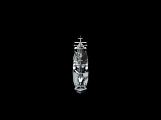
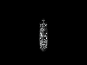
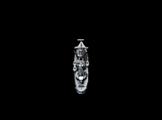

# 부산 프리깃 및 구축함

updated : 2021-04-08 15:02:55

  [중립 테크 트리](neutraltree)

***

목차
* TOC
{:toc}

***



## 1. 계통도

<table class="busantree">
	<tr>
		<th rowspan="4">FF. Frigate-01 (1레벨)</th>
		<td rowspan="4">↔</td>
		<th>FF. Frigate-01 M1 (2레벨)</th>
	</tr>
	<tr>
		<th>FF. Frigate-01 M2 (2레벨)</th>
	</tr>
	<tr>
		<th>FF. Frigate-01 M3 (2레벨)</th>
	</tr>
	<tr>
		<th>FF. Frigate-11 (14레벨)</th>
	</tr>
	<tr>
		<td>↓</td>
		<td></td>
		<td></td>
	</tr>
	<tr>
		<th rowspan="4">FF. Frigate-02 (3레벨)</th>
		<td rowspan="4">↔</td>
		<th>FF. Frigate-02 M1 (4레벨)</th>
	</tr>
	<tr>
		<th>FF. Frigate-02 M2 (4레벨)</th>
	</tr>
	<tr>
		<th>FF. Frigate-02 M3 (4레벨)</th>
	</tr>
	<tr>
		<th>FF. Frigate-21 (21레벨)</th>
	</tr>
	<tr>
		<td>↓</td>
		<td></td>
		<td></td>
	</tr>
	<tr>
		<th rowspan="3">DD. Destroyer-01 (5레벨)</th>
		<td rowspan="3">↔</td>
		<th>DD. Destroyer-01 M1 (6레벨)</th>
	</tr>
	<tr>
		<th>DD. Destroyer-01 M2 (6레벨)</th>
	</tr>
	<tr>
		<th>DD. Destroyer-01 M3 (6레벨)</th>
	</tr>
	<tr>
		<td>↓</td>
		<td></td>
		<td></td>
	</tr>
	<tr>
		<th rowspan="3">DD. Destroyer-02 (9레벨)</th>
		<td rowspan="3">↔</td>
		<th>DD. Destroyer-02 M1 (10레벨)</th>
	</tr>
	<tr>
		<th>DD. Destroyer-02 M2 (10레벨)</th>
	</tr>
	<tr>
		<th>DD. Destroyer-02 M3 (10레벨)</th>
	</tr>
	<tr>
		<td>↓</td>
		<td></td>
		<td></td>
	</tr>
	<tr>
		<td rowspan="7">(국적 선택)</td>
		<td rowspan="7">→</td>
		<th id="treetotalusn">미국 DD. Fletcher (12레벨)</th>
	</tr>
	<tr>
		<th id="treetotalrn">영국 DD. O class (12레벨)</th>
	</tr>
	<tr>
		<th id="treetotalijn">일본 DD. Kagero (12레벨)</th>
	</tr>
	<tr>
		<th id="treetotalkm">독일 DD. Z1 Class (12레벨)</th>
	</tr>
	<tr>
		<th id="treetotalmn">프랑스 DD. Jaguar (12레벨)</th>
	</tr>
	<tr>
		<th id="treetotalsn">소련 DD. Storozevoj (12레벨)</th>
	</tr>
	<tr>
		<th id="treetotalrm">이탈리아 DD. Leone (12레벨)</th>
	</tr>
	<tr>
		<td>↓</td>
		<td></td>
		<td></td>
	</tr>
	<tr>
		<th>FF. Frigate-X (22레벨)</th>
		<td></td>
		<td></td>
	</tr>
	<tr>
		<td>↓</td>
		<td></td>
		<td></td>
	</tr>
	<tr>
		<th>FF. Frigate-Y (25레벨)</th>
		<td></td>
		<td></td>
	</tr>
</table>

## 2. 함선 목록

### 2.1. Frigate-01 (1레벨)

함선 기본 스펙 펼치기/접기

<table class="busanspec">
	<tr>
		<th>DP</th>
		<td>4800</td>
	</tr>
	<tr>
		<th>탑승 레벨</th>
		<td>1</td>
	</tr>
	<tr>
		<th>기본 배수량</th>
		<td>1122</td>
	</tr>
	<tr>
		<th>만재 배수량</th>
		<td>1600</td>
	</tr>
	<tr>
		<th>선회력</th>
		<td>38</td>
	</tr>
	<tr>
		<th>대미지 감소</th>
		<td>3%</td>
	</tr>
	<tr>
		<th>최대 피격 AP 대미지</th>
		<td>96</td>
	</tr>
	<tr>
		<th>함재기 동시발진 수</th>
		<td>0</td>
	</tr>
	<tr>
		<th>함재기 용적</th>
		<td>0</td>
	</tr>
	<tr>
		<th>주포병 수</th>
		<td>2</td>
	</tr>
	<tr>
		<th>부포병 수</th>
		<td>0</td>
	</tr>
	<tr>
		<th>보조병 수</th>
		<td>1</td>
	</tr>
	<tr>
		<th>가격</th>
		<td>30</td>
	</tr>
</table>

주요 컴포넌트 펼치기/접기

<table class="busancomponents">
	<tr>
		<th>주요 주포</th>
		<th>포문 수</th>
		<th>최대 사격 횟수</th>
		<th>최대 고각</th>
		<th>사정거리</th>
		<th>기본 연사 속도(초)</th>
		<th>무게(톤)</th>
		<th>제한 레벨</th>
		<th>필요 병종</th>
	</tr>
	<tr>
		
	</tr>
</table>

<table class="busancomponents">
	<tr>
		<th>주요 엔진</th>
		<th>오버힛 지속시간(초)</th>
		<th>무게(톤)</th>
		<th>오버힛 가능 최소 DP</th>

	</tr>
	<tr>
		
		<td>1920</td>
	</tr>
</table>

<table class="busancomponents">
	<tr>
		<th>FCS</th>
		<th>명중 보너스</th>
		<th>착탄 보정 거리</th>
		<th>어뢰 탐지 거리</th>
		<th>무게(톤)</th>
	</tr>
	<tr>
		
	</tr>
</table>

개요

네이비필드에서 최초로 탑승할 수 있는 함선이다.

#### 2.1.1. Frigate-01 M1 (2레벨)

함선 기본 스펙 펼치기/접기

<table class="busanspec">
	<tr>
		<th>DP</th>
		<td>4300</td>
	</tr>
	<tr>
		<th>탑승 레벨</th>
		<td>2</td>
	</tr>
	<tr>
		<th>기본 배수량</th>
		<td>1122</td>
	</tr>
	<tr>
		<th>만재 배수량</th>
		<td>1600</td>
	</tr>
	<tr>
		<th>선회력</th>
		<td>38</td>
	</tr>
	<tr>
		<th>대미지 감소</th>
		<td>2.4%</td>
	</tr>
	<tr>
		<th>최대 피격 AP 대미지</th>
		<td>96</td>
	</tr>
	<tr>
		<th>함재기 동시발진 수</th>
		<td>0</td>
	</tr>
	<tr>
		<th>함재기 용적</th>
		<td>0</td>
	</tr>
	<tr>
		<th>주포병 수</th>
		<td>2</td>
	</tr>
	<tr>
		<th>부포병 수</th>
		<td>0</td>
	</tr>
	<tr>
		<th>보조병 수</th>
		<td>1</td>
	</tr>
	<tr>
		<th>가격</th>
		<td>30</td>
	</tr>
	<tr>
		<th>개장 비용</th>
		<td>0</td>
	</tr>
</table>

주요 컴포넌트 펼치기/접기

<table class="busancomponents">
	<tr>
		<th>주요 주포</th>
		<th>포문 수</th>
		<th>최대 고각</th>
		<th>기본 연사 속도(초)</th>
		<th>무게(톤)</th>
		<th>제한 레벨</th>
		<th>필요 병종</th>
	</tr>
	<tr>
			</tr>
</table>	

<table class="busancomponents">
	<tr>
		<th>주요 엔진</th>
		<th>오버힛 지속시간(초)</th>
		<th>무게(톤)</th>
		<th>오버힛 가능 최소 DP</th>
	</tr>
	<tr>
		
		<td>1720</td>
	</tr>
</table>

<table class="busancomponents">
	<tr>
		<th>FCS</th>
		<th>명중 보너스</th>
		<th>착탄 보정 거리</th>
		<th>어뢰 탐지 거리</th>
		<th>무게(톤)</th>
	</tr>
	<tr>
		
	</tr>
</table>

개요

Frigate-01의 화력 강화형. DP가 감소하고 주포와 FCS의 용적이 상승하였다.

#### 2.1.2. Frigate-01 M2 (2레벨)

함선 기본 스펙 펼치기/접기

<table class="busanspec">
	<tr>
		<th>DP</th>
		<td>5300</td>
	</tr>
	<tr>
		<th>탑승 레벨</th>
		<td>2</td>
	</tr>
	<tr>
		<th>기본 배수량</th>
		<td>1122</td>
	</tr>
	<tr>
		<th>만재 배수량</th>
		<td>1600</td>
	</tr>
	<tr>
		<th>선회력</th>
		<td>30</td>
	</tr>
	<tr>
		<th>대미지 감소</th>
		<td>3.6%</td>
	</tr>
	<tr>
		<th>최대 피격 AP 대미지</th>
		<td>96</td>
	</tr>
	<tr>
		<th>함재기 동시발진 수</th>
		<td>0</td>
	</tr>
	<tr>
		<th>함재기 용적</th>
		<td>0</td>
	</tr>
	<tr>
		<th>주포병 수</th>
		<td>2</td>
	</tr>
	<tr>
		<th>부포병 수</th>
		<td>0</td>
	</tr>
	<tr>
		<th>보조병 수</th>
		<td>1</td>
	</tr>
	<tr>
		<th>가격</th>
		<td>30</td>
	</tr>
	<tr>
		<th>개장 비용</th>
		<td>0</td>
	</tr>
</table>

주요 컴포넌트 펼치기/접기

<table class="busancomponents">
	<tr>
		<th>주요 주포</th>
		<th>포문 수</th>
		<th>최대 고각</th>
		<th>기본 연사 속도(초)</th>
		<th>무게(톤)</th>
		<th>제한 레벨</th>
		<th>필요 병종</th>
	</tr>
	<tr>
		
	</tr>
</table>	

<table class="busancomponents">
	<tr>
		<th>주요 엔진</th>
		<th>오버힛 지속시간(초)</th>
		<th>무게(톤)</th>
		<th>오버힛 가능 최소 DP</th>
	</tr>
	<tr>
		
		<td>2120</td>
	</tr>
</table>

<table class="busancomponents">
	<tr>
		<th>FCS</th>
		<th>명중 보너스</th>
		<th>착탄 보정 거리</th>
		<th>어뢰 탐지 거리</th>
		<th>무게(톤)</th>
	</tr>
	<tr>
		
	</tr>
</table>

개요

Frigate-01의 방어력 강화형. 기동성이 감소하고 DP가 상승하였다.

#### 2.1.3. Frigate-01 M3 (2레벨)

함선 기본 스펙 펼치기/접기

<table class="busanspec">
	<tr>
		<th>DP</th>
		<td>4800</td>
	</tr>
	<tr>
		<th>탑승 레벨</th>
		<td>2</td>
	</tr>
	<tr>
		<th>기본 배수량</th>
		<td>1122</td>
	</tr>
	<tr>
		<th>만재 배수량</th>
		<td>1600</td>
	</tr>
	<tr>
		<th>선회력</th>
		<td>46</td>
	</tr>
	<tr>
		<th>대미지 감소</th>
		<td>3%</td>
	</tr>
	<tr>
		<th>최대 피격 AP 대미지</th>
		<td>96</td>
	</tr>
	<tr>
		<th>함재기 동시발진 수</th>
		<td>0</td>
	</tr>
	<tr>
		<th>함재기 용적</th>
		<td>0</td>
	</tr>
	<tr>
		<th>주포병 수</th>
		<td>2</td>
	</tr>
	<tr>
		<th>부포병 수</th>
		<td>0</td>
	</tr>
	<tr>
		<th>보조병 수</th>
		<td>1</td>
	</tr>
	<tr>
		<th>가격</th>
		<td>30</td>
	</tr>
	<tr>
		<th>개장 비용</th>
		<td>0</td>
	</tr>
</table>

주요 컴포넌트 펼치기/접기

<table class="busancomponents">
	<tr>
		<th>주요 주포</th>
		<th>포문 수</th>
		<th>최대 고각</th>
		<th>기본 연사 속도(초)</th>
		<th>무게(톤)</th>
		<th>제한 레벨</th>
		<th>필요 병종</th>
	</tr>
	<tr>
		
	</tr>
</table>	

<table class="busancomponents">
	<tr>
		<th>주요 엔진</th>
		<th>오버힛 지속시간(초)</th>
		<th>무게(톤)</th>
		<th>오버힛 가능 최소 DP</th>
	</tr>
	<tr>
		
		<td>1920</td>
	</tr>
</table>

<table class="busancomponents">
	<tr>
		<th>FCS</th>
		<th>명중 보너스</th>
		<th>착탄 보정 거리</th>
		<th>어뢰 탐지 거리</th>
		<th>무게(톤)</th>
	</tr>
	<tr>
		
	</tr>
</table>

개요

Frigate-01의 기동력 강화형. 화력이 감소하고 선회능력과 오버힛 속도가 상승하였다.

#### 2.1.4. Frigate-11 (14레벨)

함선 기본 스펙 펼치기/접기

<table class="busanspec">
	<tr>
		<th>DP</th>
		<td>5400</td>
	</tr>
	<tr>
		<th>탑승 레벨</th>
		<td>14</td>
	</tr>
	<tr>
		<th>기본 배수량</th>
		<td>1306</td>
	</tr>
	<tr>
		<th>만재 배수량</th>
		<td>1900</td>
	</tr>
	<tr>
		<th>선회력</th>
		<td>36</td>
	</tr>
	<tr>
		<th>대미지 감소</th>
		<td>4%</td>
	</tr>
	<tr>
		<th>최대 피격 AP 대미지</th>
		<td>114</td>
	</tr>
	<tr>
		<th>함재기 동시발진 수</th>
		<td>0</td>
	</tr>
	<tr>
		<th>함재기 용적</th>
		<td>0</td>
	</tr>
	<tr>
		<th>주포병 수</th>
		<td>2</td>
	</tr>
	<tr>
		<th>부포병 수</th>
		<td>0</td>
	</tr>
	<tr>
		<th>보조병 수</th>
		<td>2</td>
	</tr>
	<tr>
		<th>가격</th>
		<td>30</td>
	</tr>
	<tr>
		<th>개장 비용</th>
		<td>5770</td>
	</tr>
</table>

주요 컴포넌트 펼치기/접기

<table class="busancomponents">
	<tr>
		<th>주요 주포</th>
		<th>포문 수</th>
		<th>최대 고각</th>
		<th>기본 연사 속도(초)</th>
		<th>무게(톤)</th>
		<th>제한 레벨</th>
		<th>필요 병종</th>
	</tr>
	<tr>
		
	</tr>
	<tr>
		
	</tr>
</table>

<table class="busancomponents">
	<tr>
		<th>주요 엔진</th>
		<th>오버힛 지속시간(초)</th>
		<th>무게(톤)</th>
		<th>오버힛 가능 최소 DP</th>
	</tr>
	<tr>
		
		<td>2160</td>
	</tr>
</table>

<table class="busancomponents">
	<tr>
		<th>FCS</th>
		<th>명중 보너스</th>
		<th>착탄 보정 거리</th>
		<th>어뢰 탐지 거리</th>
		<th>무게(톤)</th>
	</tr>
	<tr>
		
	</tr>
</table>

개요

Frigate-01의 최종 개장형. 주포 3포탑이 모두 뒤에 몰려있으나 전방 주포 1문, 후방 주포 2문 판정이므로 주포병은 그대로 2명이 탑승한다. 단, 전방 주포로 판정되는 함포 역시 후방 주포와 같은 가동범위를 가지므로 후방으로는 자유롭게 사격이 가능하나 전방을 향해서는 일정 부분 사각이 존재한다.

### 2.2. Frigate-02 (3레벨)

함선 기본 스펙 펼치기/접기

<table class="busanspec">
	<tr>
		<th>DP</th>
		<td>4200</td>
	</tr>
	<tr>
		<th>탑승 레벨</th>
		<td>3</td>
	</tr>
	<tr>
		<th>기본 배수량</th>
		<td>1043</td>
	</tr>
	<tr>
		<th>만재 배수량</th>
		<td>1650</td>
	</tr>
	<tr>
		<th>선회력</th>
		<td>41</td>
	</tr>
	<tr>
		<th>대미지 감소</th>
		<td>5%</td>
	</tr>
	<tr>
		<th>최대 피격 AP 대미지</th>
		<td>99</td>
	</tr>
	<tr>
		<th>함재기 동시발진 수</th>
		<td>0</td>
	</tr>
	<tr>
		<th>함재기 용적</th>
		<td>0</td>
	</tr>
	<tr>
		<th>주포병 수</th>
		<td>2</td>
	</tr>
	<tr>
		<th>부포병 수</th>
		<td>2</td>
	</tr>
	<tr>
		<th>보조병 수</th>
		<td>0</td>
	</tr>
	<tr>
		<th>가격</th>
		<td>30</td>
	</tr>
	<tr>
		<th>개장 비용</th>
		<td>0</td>
	</tr>
</table>

주요 컴포넌트 펼치기/접기

<table class="busancomponents">
	<tr>
		<th>주요 주포</th>
		<th>포문 수</th>
		<th>최대 고각</th>
		<th>기본 연사 속도(초)</th>
		<th>무게(톤)</th>
		<th>제한 레벨</th>
		<th>필요 병종</th>
	</tr>
	<tr>
		
	</tr>
</table>	

<table class="busancomponents">
	<tr>
		<th rowspan="2">주요 어뢰 발사관</th>
		<th rowspan="2">연장</th>
		<th rowspan="2">기본 연사 속도(초)</th>
		<th colspan="2">어뢰 속도</th>
		<th colspan="2">어뢰 사정거리</th>
		<th rowspan="2">무게(톤)</th>
		<th rowspan="2">제한 레벨</th>
		<th rowspan="2">필요 병종</th>
	</tr>
	<tr>
		<th>저속</th>
		<th>고속</th>
		<th>저속</th>
		<th>고속</th>
	</tr>
	<tr>
		
	</tr>
</table>

<table class="busancomponents">
	<tr>
		<th>주요 엔진</th>
		<th>오버힛 지속시간(초)</th>
		<th>무게(톤)</th>
		<th>오버힛 가능 최소 DP</th>
	</tr>
	<tr>
		
		<td>1680</td>
	</tr>
</table>

<table class="busancomponents">
	<tr>
		<th>FCS</th>
		<th>명중 보너스</th>
		<th>착탄 보정 거리</th>
		<th>어뢰 탐지 거리</th>
		<th>무게(톤)</th>
	</tr>
	<tr>
		
	</tr>
</table>

개요

2번째로 탑승 가능한 프리깃이다. Frigate-01에 비해 DP가 낮고 주포탑 수도 부족하나 기동성은 더 높으며, 어뢰발사관을 사용할 수 있다. 특이하게도 좌측 부포가 전방 판정을 받고, 우측 부포가 후방 판정을 받는다. 발사는 좌우측 부포 모두 전방으로만 가능하다.
